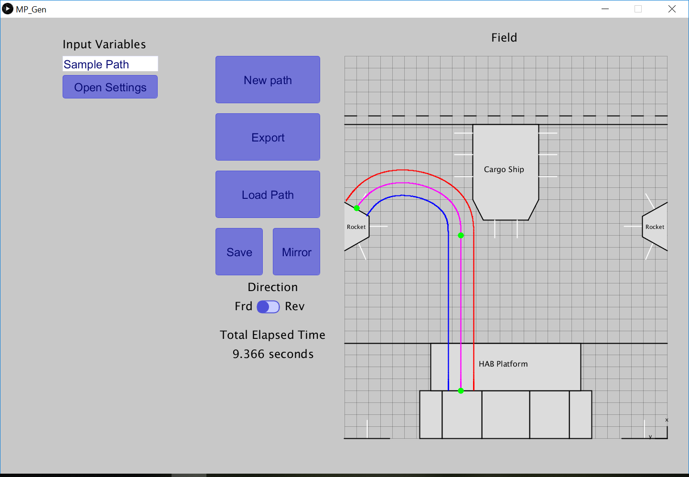

# MP-Generator - GUI for creating Motion Profiles

This project is designed to be an easy to use GUI for generating motion profiles for the FIRST Robotics Competition. It is designed to use as little text input as possible, so all path planning can be done exclusivly by the mouse. For detailed instructions on its use, please see the wiki. 
